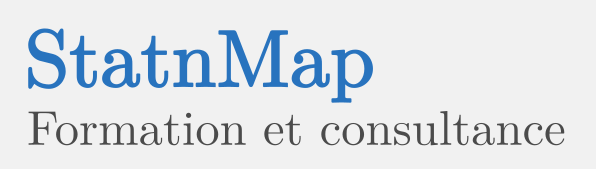

```{r setup, include=FALSE, purl=FALSE}
require(knitr)

options(formatR.arrow = TRUE, width = 30, scipen = 6, digits = 3)
knitr::knit_theme$set("nuvola")
knitr::opts_chunk$set(
  echo = FALSE,
  fig.pos = "!h",
  # out.width = "45%", # Do not use here as shown below.
  tidy.opts = list(width.cutoff = 60)
)

# Allow to add complete chunk for rendering with background in pdf
# Modified from http://stackoverflow.com/questions/19908158/show-an-r-markdown-chunk-in-the-final-output#19945637
hook_source_def = knit_hooks$get('source')
knit_hooks$set(source = function(x, options) {
  if (!is.null(options$verbatim) && options$verbatim) {
    opts = gsub(",\\s*verbatim\\s*=\\s*TRUE\\s*", "", options$params.src)
    bef = sprintf('\n    ```{r %s}\n', opts, "\n")
    outputFormat <- knitr:::pandoc_to()
    if (outputFormat == 'latex') {
      bg.begin <- "\\begin{blueShaded}\n\\begin{verbatim}"
      bg.end <- "\\end{verbatim}\\end{blueShaded}"
    } else {
      bg.begin <- "<div class='blueShaded'>\n```"
      bg.end <- "```\n</div>"
    }
    stringr::str_c(bg.begin, bef, paste(knitr:::indent_block(x, "    "), collapse = '\n'), "\n    ```\n", bg.end)
  } else {
     hook_source_def(x, options)
  }
})
# Source the formatting functions detailed below
# source("./R/functions.R")
# devtools::install_github("statnmap/Rmarkdown_tips")
library(KnitFmt)
```
***
`r if (lang == "EN") {knitr::include_graphics('./myfigdirectory/gb.png', dpi = 400)} else if (lang == "FR") {knitr::include_graphics('./myfigdirectory/fr.png', dpi = 400)}` `r if (lang == "EN") {"This version is the english version."} else if (lang == "FR") {"Cette version est la version française."}`  

<!-- english -->
```{r WebsiteEN, echo=FALSE, eval=(lang == "EN"), results='asis'}
if (knitr:::pandoc_to() == "html") {beginStyleFmt("Large", "div")}
cat(
'Go back on my website:  
[](https://statnmap.com/en/)  
[HOME](https://statnmap.com/en/) | [BLOG](https://statnmap.com/en/category/blog/) | [TUTORIALS](https://statnmap.com/en/courses-formation-sig-dans-r-et-qgis/) | [CONTACT](https://statnmap.com/en/contact/)',
sep = "")
if (knitr:::pandoc_to() == "html") {endStyleFmt("Large", "div")}
```
<!-- french -->
```{r WebsiteFR, echo=FALSE, eval=(lang == "FR"), results='asis'}
if (knitr:::pandoc_to() == "html") {beginStyleFmt("Large", "div")}
cat(
'Retourner sur le site Internet :  
[](https://statnmap.com/)  
[ACCUEIL](https://statnmap.com/) | [BLOG](https://statnmap.com/category/blog/) | [FORMATIONS](https://statnmap.com/courses-formation-sig-dans-r-et-qgis/) | [CONTACT](https://statnmap.com/en/contact/)',
sep = "")
if (knitr:::pandoc_to() == "html") {endStyleFmt("Large", "div")}
```

<!-- english -->
```{r PresentEN, echo=FALSE, eval=(lang == "EN"), results='asis'}
cat(
'_This page is presented [here on my website](https://statnmap.com/2017/03/rmarkdown-conditional-chunks-to-create-multilingual-pdf-and-html-with-images/)_',
sep = "")
```
<!-- french -->
```{r PresentFR, echo=FALSE, eval=(lang == "FR"), results='asis'}
cat(
'_Cette page est présentée [ici sur mon site Internet](https://statnmap.com/2017/03/rmarkdown-conditional-chunks-to-create-multilingual-pdf-and-html-with-images/)_',
sep = "")
```

***
<!-- english -->
```{r KnitMultipleEN, echo=FALSE, eval=(lang == "EN"), results='asis'}
cat(
'# Knit with multiple rendering options
I want to be able to knit my rmarkdown documents in different speaking language (english and french). I also want them to give similar rendering in html and in latex pdf so that I can use them in my courses as html version on the laptop, but also as printed version through the latex pdf. By the way, I also have a teacher and a student version for the R-scripts that I can purl from the Rmd file.  
This means many options for a **unique** rmarkdown document. Using a unique document allow me to directly modify things for the different versions at the same place. I do not have to jump from a file to another and verify that I copied every modification in the R-script or other...  
I personally use an external _"run-all"_ R-script to choose options to run the different versions and rename output files.

## A non exhaustive list
In this article, I list some of the tips I have to use to make this work and some bonus:

- Use chunks options to render text according to speaking language chosen,
- Use functions to render text color, background or format similar in pdf and html outputs,
- Print inline (or not) images depending on speaking language,
    + Render two images side by side and centered on the page for html and pdf,
- Allow verbatim chunk environment with background color for html and pdf,
- Output R-script included in chunks for tutorials, with different versions for teacher and students.

I will modify this list if I face new difficulties or I find better ways to do things.  
Files needed to create this article are stored [here on my github](https://github.com/statnmap/Rmarkdown_tips).',
sep = "")
```
<!-- french -->
```{r KnitMultipleFR, echo=FALSE, eval=(lang == "FR"), results='asis'}
cat(
'# "Knit" avec plusieurs options de rendu
Mes documents rmarkdown sont créés en différentes langues (français et anglais). Je fais aussi en sorte que le rendu final soit similaire entre une sortie pdf et une sortie html. De cette manière, je peux utiliser la sortie html pour la version électronique de mes formations et proposer une version papier à partir du pdf.  
Par ailleurs, j\'ai aussi une version (partielle) des codes R pour les étudiants et une (qui marche) pour le formateur. Ces codes R sont produits à partir de la feuille de route rmarkdown qui passe par la commande "purl".  
Cela signifie que j\'ai plusieurs options qui sont inclues dans un unique document rmarkdown. Utiliser un unique document me permet d\'apporter les modifications et mises à jour de mes formations dans le même fichier. Je n\'ai pas besoin de me balader entre différents documents pour m\'assurer que les mises à jour ont été apportées partout dans les feuilles de route et les scripts R.  
En règle générale, j\'utilise un script R dit _"run-all"_ qui permet de choisir les différentes options pour produire les différentes versions html, pdf, script R étudiant et formateur (que l\'on peut mettre dans une boucle "for").  

## Une liste non exhaustive
Dans cet article, je liste différentes astuces que je dois utiliser pour rendre ces différentes versions possibles ainsi que quelques bonus:  

- Utilisation des options des "chunks" pour produire les textes en fonction de la langue choisie,
- Utilisation de fonctions pour formater ou colorer du texte et son arrière-plan, de manière similaire en pdf ou en html,
- Afficher des images dans le texte en fonction de la langue choisie,
    + Afficher deux images côte à côte et centrée sur la page en html et en pdf,
- Colorer l\'arrière plan d\'une zone de code créée avec un environement "verbatim",
- Sortir d\'un fichier rmarkdown le code R des "chunks" pour vos formations, avec une version différente entre le formateur et les participants.  

Je modifirai la liste si je fais face à de nouvelles difficultés ou si je trouve de meilleures manières de faire les choses.  
Les fichiers nécessaires à la création de cet article sont [ici sur mon github](https://github.com/statnmap/Rmarkdown_tips).',
sep = "")
```

```{r Version, echo=TRUE}
packageVersion("knitr")
```

<!-- english -->
```{r FunctionsEN, echo=FALSE, eval=(lang == "EN"), results='asis'}
cat(
'## Functions for html or pdf specific rendering
Because some text and background colors are not written in the same way for html and lateX outputs, I need to use functions that will add either html formatting or latex formatting:  

- ', styleFmt("colFmt", "codecommand"), ' is used directly with color names like blue, red, ...
- ', styleFmt("styleFmt", "codecommand"), ' is used in combination with definition of a style in external files.
- ', styleFmt("beginStyleFmt", "codecommand"), ' and ', styleFmt("endStyleFmt", "codecommand"), ' are a separated variante of ', styleFmt("styleFmt", "codecommand"), ' to be used if your text contain special characters (like underscore) that may be misinterpretated by lateX.  
Option ', styleFmt("type", "codecommand"), ' can be defined to use ', styleFmt("div", "codecommand"), ' instead of ', styleFmt("span", "codecommand"), ' to allow multiple lines with html output. Similarly for latex, if ', styleFmt("type == \"div\"", "codecommand"), ' is defined, command will be used with ', styleFmt("begin", "codecommand"), ' and ', styleFmt("end", "codecommand"), '.  
- ', styleFmt("beginVerbatim", "codecommand"), ' and ', styleFmt("endVerbatim", "codecommand"), ' are specific to embed verbatim code text with background color, which is not implemented by default in lateX.',
sep = "")
```
<!-- français -->
```{r FunctionsFR, echo=FALSE, eval=(lang == "FR"), results='asis'}
cat(
'## Fonctions pour créer un rendu spécifique selon le format html ou pdf
Les couleurs de texte ou de fond ne se codent pas de la même manière en html ou en lateX. J\'ai donc créé des fonctions spécifiques qui reconnaissent le format de sortie et ajoute le code de formattage adéquat:

- ', styleFmt("colFmt", "codecommand"), ' est utilisé pour colorer du texte en utilisant les noms des couleurs reconnues en lateX et html comme "blue", "red", ...
- ', styleFmt("styleFmt", "codecommand"), ' est utilisé en combinaison avec la définition de styles dans un fichier à part.
- ', styleFmt("beginStyleFmt", "codecommand"), ' et ', styleFmt("endStyleFmt", "codecommand"), ' sont une variante séparée de ', styleFmt("styleFmt", "codecommand"), ' qui peut s\'utiliser lorsqu\'il y a des caractères spéciaux dans le texte (comme underscore) qui peuvent être mal interprétés avec lateX.  
L\'ption ', styleFmt("type", "codecommand"), ' permet notamment d\'utiliser ', styleFmt("div", "codecommand"), ' au lieu de ', styleFmt("span", "codecommand"), ' pour permettre d\'afficher du texte sur plusieurs lignes. De manière similaire avec lateX, si ', styleFmt("type == \"div\"", "codecommand"), ' est défini, la commande utilisera une ouverture du format avec ', styleFmt("begin", "codecommand"), ' et une fermeture avec ', styleFmt("end", "codecommand"), '.  
- ', styleFmt("beginVerbatim", "codecommand"), ' et ', styleFmt("endVerbatim", "codecommand"), ' sont spécifiques au format "verbatim". Ces fonctions permettent d\'encadrer une zone de code avec une couleur de fond, ce qui n\'est pas implémenté par défaut avec lateX notamment.',
sep = "")
```
```{r R-functions, echo=TRUE, purl=FALSE, eval=FALSE}
# Simple color Format functions 
colFmt <- function(x, colorname, type = "span") {
  outputFormat <- knitr:::pandoc_to()
  if (outputFormat %in% c('latex', 'beamer'))
    paste0("\\textcolor{", colorname, "}{", x, "}")
  else if (outputFormat == 'html')
    paste0("<", type, " class='", colorname, "'>", x, "</", type, ">")
  else
    x
}
# Style format function, not specific for textcolor
styleFmt <- function(x, textstyle, type = "span") {
  outputFormat <- knitr:::pandoc_to()
  if (outputFormat %in% c('latex', 'beamer'))
    paste0("\\", textstyle, "{", x, "}")
  else if (outputFormat == 'html')
    paste0("<", type," class='", textstyle, "'>", x, "</", type, ">")
  else
    x
}
# Style format options for longer text output
beginStyleFmt <- function(textstyle, type = "span") {
  outputFormat <- knitr:::pandoc_to()
  if (outputFormat %in% c('latex', 'beamer')) {
    if (type == "div") {
      cat("\\nopandoc\\begin{", textstyle, "}}\n", sep = "")
    } else {
      paste0("\\", textstyle, "{")
    }
  } else if (outputFormat == 'html') {
    if (type == "div") {
      cat("<", type, " class='", textstyle, "'>", sep = "")
    } else {
      paste0("<", type, " class='", textstyle, "'>")
    }
  } else {
    ""
  }
}
endStyleFmt <- function(textstyle, type = "span") {
  outputFormat <- knitr:::pandoc_to()
  if (outputFormat %in% c('latex', 'beamer')) {
    if (type == "div") {
      cat("\n\\nopandoc{\\end{", textstyle, "}}", sep = "")
    } else {
      paste0("}")
    }
  } else if (outputFormat == 'html') {
    if (type == "div") {
      cat("</", type, ">", sep = "")
    } else {
      paste0("</", type, ">")
    }
  } else {
    ""
  }
}
# Specific to verbatim environment 
# to be able to show you the 'asis' chunks with background color.
beginVerbatim <- function() {
  outputFormat <- knitr:::pandoc_to()
  if (outputFormat %in% c('latex', 'beamer')) {
    cat("\\begin{blueShaded}\n\\begin{verbatim}\n")
  } else if (outputFormat == 'html') {
    cat("<div class='blueShaded'>\n```\n", sep = "")
  } else {
    ""
  }
}
endVerbatim <- function() {
  outputFormat <- knitr:::pandoc_to()
  if (outputFormat %in% c('latex', 'beamer')) {
    cat("\\end{verbatim}\\end{blueShaded}")
  } else if (outputFormat == 'html') {
    cat("\n```\n</div>", sep = "")
  } else {
    ""
  }
}
```

<!-- english -->
```{r HeaderLateXEN, echo=FALSE, eval=(lang == "EN"), results='asis'}
cat(
'The definition of different styles are in external lateX header file for pdf outputs and should be called in the YAML header of your rmarkdown file ', beginStyleFmt("codecommand"), 'in\\_header: header.tex', endStyleFmt("codecommand"), '. This lateX file should include the definition of all colors and format to be used with the previous functions. For instance, here:', 
sep = "")
```
<!-- french -->
```{r HeaderLateXFR, echo=FALSE, eval=(lang == "FR"), results='asis'}
cat(
'Pour définir les différentes styles lateX nécessaires au bon fonctionnement des fonctions ci-dessus, vous devez créer un fichier lateX qui doit être appelé dans l\'en-tête YAML de votre fichier Rmd de cette façon:', beginStyleFmt("codecommand"), 'in\\_header: header.tex', endStyleFmt("codecommand"), '. Ce fichier doit inclure la définition de toutes les couleurs et format que vous souhaitez utiliser avec les fonctions précédentes. Par exemple ici :', 
sep = "")
```

```latex
  \usepackage{color}
  \definecolor{blueSeb}{RGB}{30,115,190}
  \definecolor{advertcolor}{HTML}{FF8929}
  
  \definecolor{backcolor}{RGB}{235, 235, 235}
  \newcommand{\mybox}[1]{\par\noindent\colorbox{backcolor}
    {\parbox{\dimexpr\textwidth-2\fboxsep\relax}{#1}}}
  
  \newcommand{\advert}[1]{\textit{\advertcolor{#1}}}
  \newcommand{\codecommand}[1]{\texttt{\colorbox{backcolor}{#1}}}
```
```{r NoPandocEN, echo=FALSE, eval=(lang == "EN"), results='asis'}
cat(
'By the way, pandoc do not consider text between ', styleFmt("begin", "codecommand"), ' and ', styleFmt("end", "codecommand"), ' lateX entries as markdown syntax. To be able to consider your markdown syntax when using functions ', styleFmt("beginStyleFmt", "codecommand"), ' and ', styleFmt("beginStyleFmt", "codecommand"), ' you need to define a command in your ', styleFmt("header.tex", "codecommand"), ' file as follows:',
sep = "")
```
```{r NoPandocFR, echo=FALSE, eval=(lang == "FR"), results='asis'}
cat(
'Par ailleurs, pandoc ne considère pas le texte inclus entre les deux entrées lateX ', styleFmt("begin", "codecommand"), ' et ', styleFmt("end", "codecommand"), ' comme de la syntaxe markdown. Pour que ce texte soit considéré comme tel lorsque vous utilisez les fonctions ', styleFmt("beginStyleFmt", "codecommand"), ' et ', styleFmt("beginStyleFmt", "codecommand"), ' vous devez définir une nouvelle commande dans votre fichier ', styleFmt("header.tex", "codecommand"), ' :',
sep = "")
```
```latex
  \newcommand{\nopandoc}[1]{#1} 
```
<!-- english -->
```{r HeaderCssEN, echo=FALSE, eval=(lang == "EN"), results='asis'}
cat(
'Similarly, for html rendering, functions should be used in an external css file with option ', styleFmt("css: style.css", "codecommand"), ' in the YAML header of your rmarkdown file. Here for instance the css file includes:
',
sep = "")
```
<!-- french -->
```{r HeaderCssFR, echo=FALSE, eval=(lang == "FR"), results='asis'}
cat(
'De même, pour le rendu html, les fonctions doivent être utilisées avec un fichier d\'accompagnement css, déclaré dans l\'en-tête YAML de votre fichier Rmd de cette façon: ', styleFmt("css: style.css", "codecommand"), '. Par exemple ici :
',
sep = "")
```

```css
  .advert {
    color: #FF8929;
    font-style: italic;
  }
  .codecommand {
    background-color:#E0E0E0;
    font-family: Courier New, Courier, monospace;
  }
  .Shaded {
    background-color:#E0E0E0;
    font-family: Courier New, Courier, monospace;
  }
```

<!-- english -->
```{r ChooseLangEN, echo=FALSE, eval=(lang == "EN"), results='asis'}
cat(
'# Choose a language to knit
If you want to be able to knit your documents in different language without using two different rmarkdown files, here are my tips.',
sep = "")
```
<!-- french -->
```{r ChooseLangFR, echo=FALSE, eval=(lang == "FR"), results='asis'}
cat(
'# Choisir une langue pour votre document
Si vous voulez produire vos document rmarkdown dans différentes langues sans utiliser différents fichiers, voici mes astuces.',
sep = "")
```

```{r R-Lang, echo=TRUE, verbatim=TRUE, eval=FALSE}
# Choose the language at the beginning of your script or knit from external file
lang <- c("EN", "FR")[1]
```

<!-- english -->
```{r AsisChunkEN, echo=FALSE, eval=(lang == "EN"), results='asis'}
cat(
'## Embed text in \'asis\' chunks
In \'asis\' chunks, with option ', styleFmt("echo=TRUE", "codecommand"),', you can write rmarkdown syntax which produces text (partially) in the correct format. The aim is to use the command ', styleFmt("eval", "codecommand"), ' to render the text according to the chosen language:  ',
sep = "")
```
<!-- french -->
```{r AsisChunkFR, echo=FALSE, eval=(lang == "FR"), results='asis'}
cat(
'## Inclure du texte dans des \`chunks\` au format \'asis\'
Dans les \`chunks\` au format \'asis\', avec l\'option ', styleFmt("echo=TRUE", "codecommand"), ', il est possible d\'écrire votre texte en utilisant la syntaxe rmarkdown. Cela produit (partiellement) le format correct comme si vous n\'étiez pas dans un chunk. L\'intérêt ici étant de pouvoir utiliser la commande ', styleFmt("eval", "codecommand"), ' pour afficher ou non le texte selon la langue désirée.  ',
sep = "")
```

```{r R-AsisChunk, echo=FALSE, results='asis'}
beginVerbatim()
cat(
'  <!-- english -->
  \`\`\`{asis, eval=(lang == "EN"), echo=TRUE}
  ### For titles and subtitles when at the beginning
  This above chunk allow for markdown syntax  
  
  ### And for titles in the middle if there is space line above
  And you can use it for normal text or _italic_ or **other**
  \`\`\`
  <!-- french -->
  \`\`\`{asis, eval=(lang == "FR"), echo=TRUE}
  ### Pour les titres et sous-titres au début du "chunk"
  Le "chunk" ci-dessus permet d\'utiliser la syntaxe markdown
  
  ### Et les titres en milieu de "chunk" s\'il y a une ligne vide avant
  Et vous pouvez utiliser le texte normal, _italic_ ou **autre**
  \`\`\`',
sep = "")
endVerbatim()
```
<!-- english -->
```{asis, eval=(lang == "EN"), echo=TRUE}
### For titles and subtitles when at the beginning
This above chunk allow for markdown syntax  

### And for titles in the middle if there is space line above
And you can use it for normal text or _italic_ or **other**
```
<!-- french -->
```{asis, eval=(lang == "FR"), echo=TRUE}
### Pour les titres et sous-titres au début du "chunk"
Le "chunk" ci-dessus permet d'utiliser la syntaxe markdown

### Et les titres en milieu de "chunk" s'il y a une ligne vide avant
Et vous pouvez utiliser le texte normal, _italic_ ou **autre**
```

<!-- Conditional title -->
`r if (lang == "EN") {"## Include R outputs in conditional chunk"} else if (lang == "FR") {"## Inclure des sorties R dans les \"chunks\" conditionnels"}`

<!-- english -->
```{r CodeInChunkEN, echo=(lang == "EN"), eval=(lang == "EN"), results='asis', verbatim=TRUE}
cat(
'### Example of title in a chunk
#### Example of subtitle in a chunk
- ', styleFmt("cat", "codecommand"), ' should be used with ',
styleFmt("sep = \"\"", "codecommand"), ' otherwise a space will be added 
before "##subtitle", which avoid it to be recognised as a subtitle in markdown.
- ', styleFmt("eval", "codecommand"), ' can be used with R object to knit 
chunk specific to language. Here ', styleFmt("lang", "codecommand"), 
' is ', lang,  '\n',
'- Double space should work to define new paragraph, but when using R
functions, it may require "\\\\n" 
_(Note the number of backslash in the code here to print "\\\\n" correctly...)_.
    + ', styleFmt("For instance when using the format function,
                  following two spaces won\'t work:", "advert"), '  ',
'    + This sentence won\'t be on a new line.',
sep = "")
```
<!-- french -->
```{r CodeInChunkFR, echo=(lang == "FR"), eval=(lang == "FR"), results='asis', verbatim=TRUE}
cat(
'### Exemple de titre dans un "chunk"
#### Exemple de sous-titre dans un "chunk"
- ', styleFmt("cat", "codecommand"), ' doit être utilisé avec l\'option ',
styleFmt("sep = \"\"", "codecommand"), ' sinon un espace sera ajouté
devant les dièses des "## sous-titres", ce qui empêche markdown de les
reconnaître comme tel.
- ', styleFmt("eval", "codecommand"), ' peut être utilisé avec un objet R
pour spécifier si le texte doit être affiché, selon le choix de la langue.
Ici here ', styleFmt("lang", "codecommand"), ' est défini comme ', lang,  '\n',
'- Les doubles espaces fonctionnent normalement pour produire un nouveau 
paragraphe, mais lorsqu\'on utilise une fonction R dans le code, il faut
parfois utiliser "\\\\n".
_(Notez le nombre de backslash que j\'ai dû utiliser pour afficher "\\\\n"
correctement...)_.
    + ', styleFmt("Par exemple, si j\'utilise ma fonction de formatage,
                  les espaces suivants ne fonctionnent pas:", "advert"),
'  ',
'    + Cette phrase ne sera pas sur une nouvelle ligne.',
sep = "")
```

<!-- english -->
```{r ImagePathEN, echo=FALSE, eval=(lang == "EN"), results='asis'}
cat(
'## Conditional images and path
### When images are in a defined directory and are shown in paragraph different that text',
sep = "")
```
<!-- french -->
```{r ImagePathFR, echo=FALSE, eval=(lang == "FR"), results='asis'}
cat(
'## Images et chemins sous conditions
### Quand vos images sont dans un dossier défini et s\'affichent dans un paragraphe différent du texte',
sep = "")
```

```{r AsisCondImg, echo=FALSE, results='asis'}
beginVerbatim()
cat(
'  \`\`\`{asis, eval=(lang == "EN")}
   Directory for english version
  \`\`\`
  \`\`\`{asis, eval=(lang == "FR")}
   Fichier pour la version française
  \`\`\`',
sep = "")
endVerbatim()
```

```{asis, eval=(lang == "EN")}
 Directory for english version
```
```{asis, eval=(lang == "FR")}
 Fichier pour la version française
```

<!-- english -->
```{r ImageChangePathEN, echo=FALSE, eval=(lang == "EN"), results='asis'}
cat(
'### When images are in a changing directory and are shown inline
Only code of the last point is shown here, but you can find the others in the raw Rmarkdown file used to create this page.'
)
```
<!-- french -->
```{r ImageChangePathFR, echo=FALSE, eval=(lang == "FR"), results='asis'}
cat(
'### Quand vos images sont dans un dossier avec condition de langue et sont affichées en ligne dans le texte
Seul le code du dernier point est affiché ici mais vous pourrez retrouver le code des autres dans le fichier original rmarkdown qui a servi à créer cette page.'
)
```

```{r R-FigDir, echo=TRUE}
figWD <- paste0("./myfigdirectory", lang)
```

- `) `r if (lang == "EN") {"Image without condition"} else if (lang == "FR") {"Image sans condition"}`
- `r knitr::include_graphics(paste0(figWD, '/fr.png'), dpi = 400)` `r if (lang == "EN") {paste("No condition but allow to resize image (if", styleFmt("out.width", "codecommand"), "is not set in general knitr options).")} else if (lang == "FR") {paste("Pas de condition mais permet de changer la taille de l'image (si", styleFmt("out.width", "codecommand"), "ne fait pas partie des options générales de knitr définie au début de votre script).")}`  

```{r R-Graphics, echo=FALSE, results='asis'}
beginVerbatim()
cat(
"  - `r 
    if (lang == \"EN\") {
      knitr::include_graphics(paste0(figWD, '/gb.png'), dpi = 400)
    } else if (lang == \"FR\") {
      knitr::include_graphics(paste0(figWD, '/fr.png'), dpi = 400)
    }`
    `r 
    if (lang == \"EN\") {
      \"Conditionnal image: English flag shown if 'lang' is 'EN'\"
    } else if (lang == \"FR\") {
      \"Image avec condition : Le drapeau français est affiché si 'lang' est 'FR'\"
    }`",
sep = "")
endVerbatim()
```
- `r if (lang == "EN") {knitr::include_graphics(paste0(figWD, '/gb.png'), dpi = 400)} else if (lang == "FR") {knitr::include_graphics(paste0(figWD, '/fr.png'), dpi = 400)}` `r if (lang == "EN") {"Conditionnal image: English flag shown if 'lang' is 'EN'"} else if (lang == "FR") {"Image avec condition : Le drapeau français est affiché si 'lang' est 'FR'"}`

<!-- english -->
```{r TwoImagesEN, echo=FALSE, eval=(lang == "EN"), results='asis'}
cat(
'# Two images side-by-side and centered
A problem while using two images side by side using ', beginStyleFmt("codecommand"), '"knitr::include\\_graphics"', endStyleFmt("codecommand"), ' in the same chunk is that option ', styleFmt("fig.align = 'center'", "codecommand"), ' applies separately to the two images, so that there are one under the other, in two different paragraphs:'
)
```
<!-- french -->
```{r TwoImagesFR, echo=FALSE, eval=(lang == "FR"), results='asis'}
cat(
'# Deux images côte-à-côte et centrées sur la page
Le problème lorsqu\'on veut afficher deux images côte-à-côte avec ', beginStyleFmt("codecommand"), '"knitr::include\\_graphics"', endStyleFmt("codecommand"), ' à partir d\'un même "chunk", c\'est que l\'option', styleFmt("fig.align = 'center'", "codecommand"), ' s\'applique séparément aux deux images, ce qui les fait apparaître l\'une sous l\'autre, dans deux paragraphes séparés:'
)
```

```{r, echo=FALSE, out.width='25%', fig.align='center'}
knitr::include_graphics(paste0(figWD, "/fr.png"))
knitr::include_graphics(paste0(figWD, "/gb.png"))
```

<!-- english -->
```{r TwoImagesLineEN, echo=FALSE, eval=(lang == "EN"), results='asis'}
cat(
'Here, we use two functions to be place before and after the chunk with ', styleFmt("results='asis'", "codecommand"), ' and a space between images:'
)
```
<!-- french -->
```{r TwoImagesLineFR, echo=FALSE, eval=(lang == "FR"), results='asis'}
cat(
'Ici, j\'utilise deux fonctions à placer avant et après le "chunk" avec ', styleFmt("results='asis'", "codecommand"), ' et un espace entre les images :'
)
```
```{r R-TwoImagesLine, echo=TRUE}
beginCentering <- function() {
  outputFormat <- knitr:::pandoc_to()
  if (outputFormat %in% c('latex', 'beamer'))
    cat("\n\\nopandoc{\\begin{center}}\n", sep = "")
  else if (outputFormat == 'html')
    cat('\n<p style="text-align: center">\n', sep = "")
  else
    ""
}
endCentering <- function() {
  outputFormat <- knitr:::pandoc_to()
  if (outputFormat %in% c('latex', 'beamer'))
    cat("\n\\nopandoc{\\end{center}}\n", sep = "")
  else if (outputFormat == 'html')
    cat("\n</p>\n", sep = "")
  else
    ""
}
```
<!-- Simple conditional text -->
`r if (lang == "EN") {"The chunk is then written as follows:"} else if (lang == "FR") {"Le \"chunk\" s'écrit donc ainsi :"}`

```{r TwoImagesLineChunkShow, echo=FALSE, results='asis'}
beginVerbatim()
cat(
'  ```{r, echo=FALSE, out.width=\'25%\', fig.align=\'default\', results=\'asis\'}
  beginCentering()
  knitr::include_graphics(paste0(figWD, "/fr.png"))
  cat("\\\\vspace{1cm}")
  cat(" ")
  knitr::include_graphics(paste0(figWD, "/gb.png"))
  endCentering()
  ```',
  sep = "")
endVerbatim()
```
<!-- We can not echo this with the two include_graphics functions -->
```{r TwoImagesLineChunkOut, echo=FALSE, out.width='25%', fig.align='default', results='asis'}
beginCentering()
knitr::include_graphics(paste0(figWD, "/fr.png"))
cat("\\vspace{1cm}")
cat(" ")
knitr::include_graphics(paste0(figWD, "/gb.png"))
endCentering()
```

<!-- english -->
```{r StudentTeacherEN, echo=FALSE, eval=(lang == "EN"), results='asis'}
cat(
'# Student and teacher versions
## Create the tutorial roadmap
This one is pretty easy. You only have to set your ', styleFmt("purl", "codecommand"), ' option depending if your chunk is for student or teacher. I personally use ', styleFmt("eval=TRUE", "codecommand"), ' with the teacher version that should produce the result targeted by students. And I use ', styleFmt("eval=FALSE", "codecommand"), ' with the student version because this version should not work.

### Exercise example
Reproduce the following figure from the "cars" dataset.',
sep = "")
```
<!-- french -->
```{r StudentTeacherFR, echo=FALSE, eval=(lang == "FR"), results='asis'}
cat(
'# Versions formateur et participants
## Créer la feuille de route de la formation
C\'est assez simple. Vous devez seulement définir la bonne option dans la commande ', styleFmt("purl", "codecommand"), ' selon que le "chunk" est pour la version formateur ou participant. Personnellement, j\'utilise ', styleFmt("eval=TRUE", "codecommand"), ' avec la version formateur qui permet de montrer aux participants les figures que les étudiants doivent cibler. Et j\'utilise ', styleFmt("eval=FALSE", "codecommand"), ' pour la version étudiante qui n\'est pas censée fonctionner.

### Exemple d\'exercice
Reproduisez la figure suivante à partir du jeu de données "cars".',
sep = "")
```

<!-- teacher -->
```{r, echo=FALSE, purl=purlT, eval=purlT, out.width='50%'}
# A script for teacher with solutions ------------------------------------------
summary(cars)
# Plot pressure against temperature
plot(pressure)

```
<!-- student -->
```{r, echo=FALSE, eval=purlS, purl=purlS}
# A script for students without solutions --------------------------------------
summary(cars)
# Plot pressure against temperature
plot(...)

```

<!-- english -->
```{r PurlRmdEN, echo=FALSE, eval=(lang == "EN"), results='asis'}
cat(
'## Purl the rmarkdown file
If you purl this rmarkdown file using the "teacher" option, you\'ll get this R script:',
sep = "")
```
<!-- french -->
```{r PurlRmdFR, echo=FALSE, eval=(lang == "FR"), results='asis'}
cat(
'## Extraire le code R du fichier rmarkdown
Après extraction du code R de ce fichier rmarkdown avec l\'option "teacher" et la commande ', styleFmt("purl", "codecommand"), 'vous obtiendrez le script R suivant :',
sep = "")
```

```{r, echo=TRUE, eval=FALSE}
# A script for teacher with solutions ------------------------------------------
summary(cars)
# Plot pressure against temperature
plot(pressure)
```

<!-- Simple conditional text -->
`r if (lang == "EN") {"And this R script if you purl with the \"student\" option:"} else if (lang == "FR") {"Et ce script R si l'extraction se fait avec l'option \"student\" :"}`

```{r, echo=TRUE, eval=FALSE}
# A script for students without solutions --------------------------------------
summary(cars)
# Plot pressure agains temperature
plot(...)

```

<!-- english -->
```{r TryItEN, echo=FALSE, eval=(lang == "EN"), results='asis'}
cat(
'# Try this script !
All files necessary to produce this page are available on [my github](https://github.com/statnmap/Rmarkdown_tips). All outputs in french and english, in pdf and html, as well as student and teacher R-script are also in the repository. Use the ', beginStyleFmt("advert"), '"Run\\_all\\_and\\_choose\\_options.R"', endStyleFmt("advert"), ' file to produce them on your own.  

## Some limits
A limit to the use of "\\begin" and "\\end" environment with lateX is that pandoc do not convert markdown syntax included in that environment. It is read as verbatim. Maybe, I\'ll find a way to get rid of that.  
One of the drawback of this kind of multilingual rmarkdown script is that code highlighting is messy in Rstudio... This specific one in very messy because I wanted to show you the complete chunks in the output file, but it is quite difficult to do it in a clean way as "asis" chunks do not allow for "echo" and "verbatim" options.
If you have any better way to do it, you can comment here or in the github repository itself.  
**By the way, if your file starts to be too big like the present one, do not hesitate to work with child Rmd files.**

# Supplemental tips
LateX default template of rmarkdown load several packages and defines several parameters to format the final text output. If you do not want to create your own template, you can define, like here a tex file to load ', beginStyleFmt("codecommand"), '"in\\_header"', endStyleFmt("codecommand"), '.  
However, you may encounter some error messages due to incompatible options. In the "header_tips.tex" file provided with the present templates, you will find different modifications of the pdf template:

- Find which language is loaded with lateX package babel and define new commands according to language chosen. This is useful here because we have a multilingual template that uses parameter ', styleFmt("lang", "codecommand"), ' in the YAML, which I parameterized according to language to knit.   
- Formatting section titles to be colored or defined as you want with package "titlesec" requires to unload section format that rmarkdown provided and revert it back.  
- Modify background color of rmarkdown verbatim box.  

***
More tips on [R, models and spatial things on my website](https://statnmap.com/en/)

***

_This page is presented [here on my website](https://statnmap.com/2017/03/rmarkdown-conditional-chunks-to-create-multilingual-pdf-and-html-with-images/)_  
[](https://statnmap.com/en/)',
sep = "")
```
<!-- french -->
```{r TryItFR, echo=FALSE, eval=(lang == "FR"), results='asis'}
cat(
'# Essayez vous-même ce script !
Tous les fichiers nécessaire à la création de cette page son disponibles sur [mon github](https://github.com/statnmap/Rmarkdown_tips). Toutes les sorties en français et en anglais, en pdf et en html, ainsi que les scripts R formateur et participants sont aussi dans le dossier. Utilisez le fichier ', beginStyleFmt("advert"), '"Run\\_all\\_and\\_choose\\_options.R"', endStyleFmt("advert"), ' pour reproduire tous les fichiers par vous-même.    

## Quelques limites
Une limite à l\'utilisation des balises "\\begin" et "\\end" avec lateX est que pandoc ne convertit pas la syntaxe markdown inclue dans cet environnement. Elle est considérée comme du code verbatim. Peut-être que je trouverai un moyen de passer outre...
Par ailleurs, une des limites de ce type de script multilingue rmarkdown, est que la coloration syntaxique dans Rstudio n\'est plus très utile... Le script utilisé pour générer cette page peut être difficile à lire, en particulier parce que j\'ai voulu vous afficher les "chunks" utilisés en entier. De plus, les chunks "asis" ne permettent pas d\'utiliser l\'option "verbatim", ce qui m\'a obligé à ajouter une couche de code ici.  
Si vous avez des meilleures manières de produire le code de cette page, vous pouvez apporter vos commentaires ici ou sur github.  
**Cela dit, si vos fichiers rmarkdown commencent à être trop volumineux, n\'hésitez pas à créer des fichiers enfants...**

# Astuces supplémentaires
Le template rmarkdown par défaut pour lateX charge un certain nombre de packages et définit un certain nombre d\'options pour la mise en forme du texte. Si vous ne voulez pas recréer vous-même un template, vous pouvez définir, comme ici, un fichier tex à charger dans l\'en-tête avec l\'option YAML ', beginStyleFmt("codecommand"), '"in\\_header"', endStyleFmt("codecommand"), '.  
Toutefois, vous pourrez rencontrer quelques messages d\'erreur dûs à des incompatibilités d\'options. Dans le fichier "header_tips.tex" que vous trouverez sur le github, vous trouverez différentes modifications du template pour pdf :

- Trouver quelle langue est chargée par R avec le package babel et définir de nouvelles commandes en fonction de la langue choisie. C\'est particulièrement utile dans le cadre de ce template multilingue qui utilise l\'option ', styleFmt("lang", "codecommand"), ' dans l\'en-tête YAML que j\'ai paramétré ici en fonction de la langue.   
- Modifier le format des titres de sections pour être colorés et définis comme vous le souhaitez, en utilisant le package "titlesec" qui nécessite d\'annuler temporairement les options proposées par rmarkdown.
- Modifier la couleur d\'arrière-plan des zones de code verbatim

***
Plus d\'astuces en lien avec [R, les modèles et les trucs spatialisés sur mon site Internet](https://statnmap.com/)

***
_Cette page est présentée [ici sur mon site Internet](https://statnmap.com/2017/03/rmarkdown-conditional-chunks-to-create-multilingual-pdf-and-html-with-images/)_  
[](https://statnmap.com/)',
sep = "")
```
